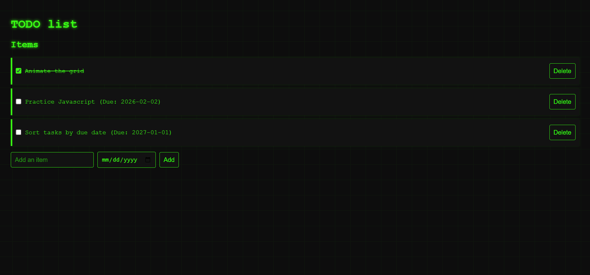

# To-Do List

A simple to-do list application built with HTML and JavaScript.

The user should be able to:
- Add new items to the list.
- Delete existing items.
- Persist the list using local storage, so it stays after page refresh.

## Table of contents

- [Overview](#overview)
  - [Screenshot](#screenshot)
  - [Links](#links)
- [My process](#my-process)
  - [Built with](#built-with)
  - [What I learned](#what-i-learned)
- [Author](#author)

## Overview

### Screenshot

  
Main To-Do List Interface

  

### Links

- [Solution URL:](https://github.com/Lasse-Rodal/To-Do-List)
- [Live Site URL:](https://lasse-rodal.github.io/To-Do-List/)

## My process

### Built with

- Semantic HTML5 markup
- Vanilla JavaScript
  - DOM manipulation
  - Event listeners
  - Array and localStorage handling

### What I learned

In this project, I practiced:

- Persisting data with `localStorage`.
- Managing a list using arrays and index-based operations.
- Creating elements and appending them to the DOM with JavaScript.

## Author

- Github - [Lasse Rodal Pedersen](https://github.com/Lasse-Rodal)